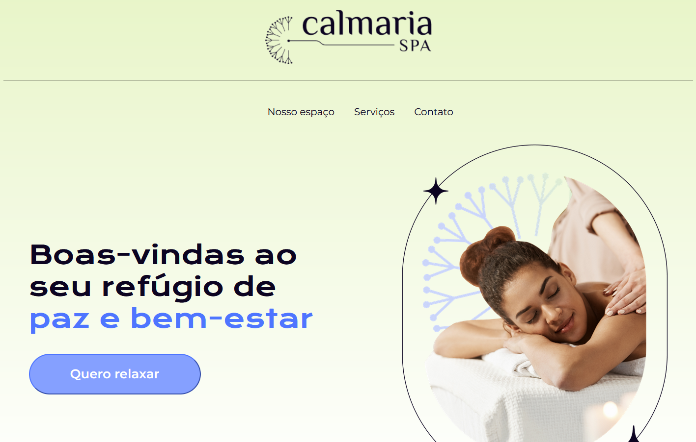
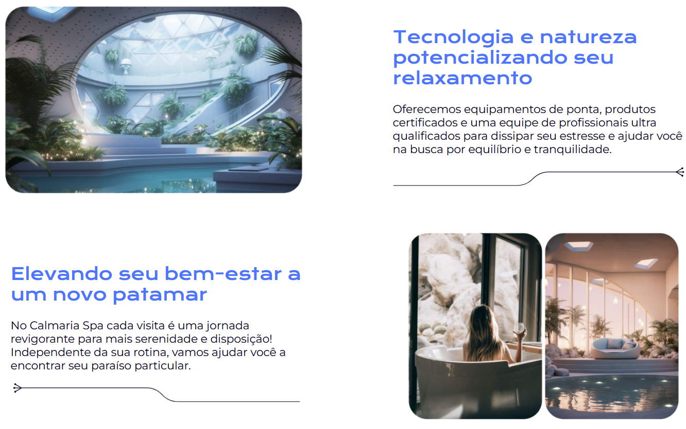
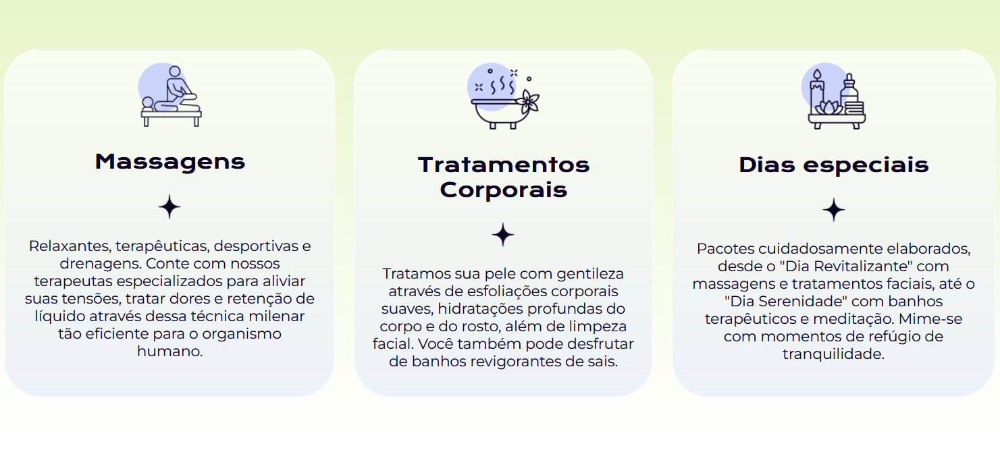
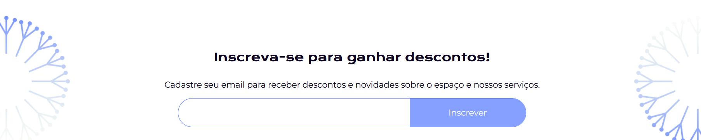
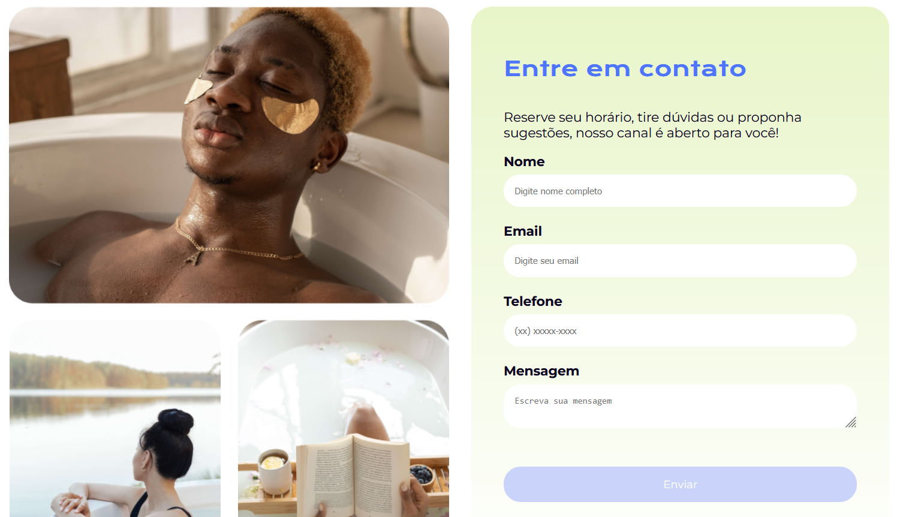

## 🧘 Calmaria Spa

O **Calmaria Spa** é uma **landing page** criada com foco na aplicação de **SASS** para organização e otimização dos estilos CSS. A página apresenta um ambiente visualmente relaxante com seções que explicam os serviços do spa, uma área para cadastro de e-mail com oferta de desconto e um formulário de contato.

 

## 🚀 Sobre o Projeto

Este projeto foi desenvolvido durante o curso da Alura:

* "SASS e CSS: estilizando um site"

Com base em uma landing page de um spa fictício, o projeto explora como utilizar **SASS** para criar folhas de estilo mais **legíveis, organizadas e reutilizáveis**. O foco está na modularização, uso de variáveis, mixins e boas práticas para facilitar a manutenção e evolução do CSS.

## 📚 Objetivos do Curso

* Aprender como utilizar os recursos do pré-processador **SASS** em projetos;
* Criar **folhas de estilos** de fácil leitura;
* Criar códigos reutilizáveis com **mixins, @extend e parent selector**;
* **Modularizar** as folhas de estilo com partial;
* Utilizar as **variáveis** para colorir e ajustar o layout de uma landing page (site);
* Fazer operações matemáticas para construir layouts.

## 🛠️ Tecnologias Utilizadas

## 🖼️ Visualização do Projeto

Uma prévia das principais funcionalidades do **Calmaria Spa**:

**🌐 Acesse o Projeto Online**

O projeto está disponível para visualização na **Vercel**. Clique no link abaixo para acessar:

**🌅 Banner Inicial**

Imagem de destaque com chamada para relaxamento e bem-estar.

**🧴 Sobre o Spa**

Seção com informações e diferenciais do spa.

**💌 Cadastro para Desconto**

Campo para inserir e-mail e receber benefícios.

**📞 Contato**

Formulário simples para o visitante enviar mensagens ao spa.

